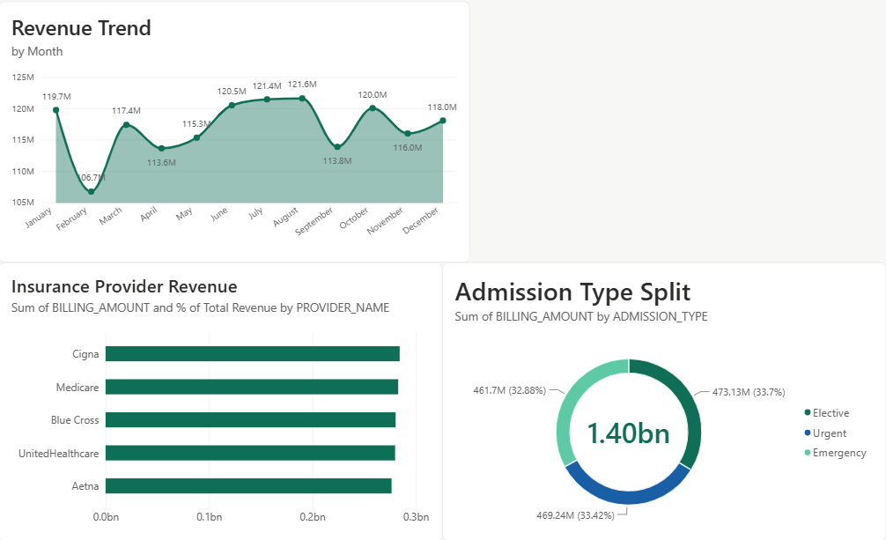
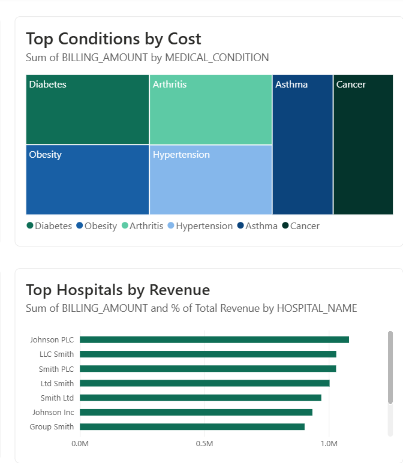
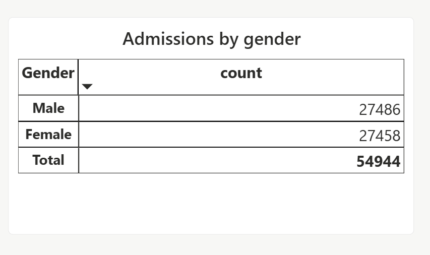

# Healthcare Analytics

## 📌 Project Overview

This project is an end-to-end **Healthcare Analytics System** that demonstrates how healthcare data can be cleaned, stored, analyzed, and visualized using Python, Oracle SQL, SQL*Loader, and Power BI.

The project follows a complete data analytics workflow:

**Raw Dataset → Python Data Cleaning → Cleaned Dataset → SQL*Loader → Oracle Database → SQL KPI Analysis → Power BI Dashboard**

---

## 🎯 Project Objectives

* Clean and prepare raw healthcare data using Python.
* Design and create a relational database in Oracle.
* Load cleaned CSV data into Oracle using SQL*Loader.
* Perform healthcare and revenue analysis using Oracle SQL.
* Calculate important business KPIs.
* Build an interactive Power BI dashboard with DAX measures.
* Demonstrate an end-to-end data analytics workflow.

---

## 🛠️ Tools & Technologies

* **Python**
* **Pandas**
* **Oracle Database**
* **Oracle SQL**
* **SQL*Loader**
* **Oracle Client / ODAC**
* **Power BI Desktop**
* **DAX**
* **GitHub**

---

## 📂 Project Structure

```text
Healthcare-Analytics/
│
├── Data/
│   ├── healthcare_dataset.csv
│   └── healthcare_dataset_cleaned.csv
│
├── Oracle SQL/
│   ├── 01_create_user.sql
│   ├── 02_schema.sql
│   ├── 03_data_loading.txt
│   ├── 04_kpi_queries.sql
│   │
│   └── ctl/
│       ├── doctors.ctl
│       ├── hospitals.ctl
│       ├── insurance_providers.ctl
│       ├── patients.ctl
│       └── admissions.ctl
│
├── Power BI/
│   ├── Healthcare_Analytics.pbix
│   └── Healthcare_Analytics_Theme.json
│
├── Python/
│   └── clean_data.py
│
├── screenshots/
│   ├── overview.png
│   ├── patient_analysis.png
│   ├── hospital_analysis.png
│   └── revenue_analysis.png
│
└── README.md
```

---

# 🐍 1. Python Data Cleaning

The raw healthcare dataset was cleaned and prepared using **Python and Pandas**.

### Cleaning Operations

* Standardized text values.
* Removed unnecessary leading/trailing spaces.
* Standardized text casing.
* Converted date columns into proper date format.
* Rounded billing amounts.
* Removed exact duplicate records.
* Calculated **Length of Stay**.
* Created an **Admission_ID**.
* Exported the cleaned dataset for database loading.

### Dataset Results

| Metric                    |  Count |
| ------------------------- | -----: |
| Raw Records               | 55,500 |
| Duplicate Records Removed |    534 |
| Clean Records             | 54,966 |

The cleaned dataset is available in:

```text
Data/healthcare_dataset_cleaned.csv
```

The Python cleaning script is available in:

```text
Python/clean_data.py
```

---

# 🗄️ 2. Oracle Database

Oracle Database is used as the relational database layer for the project.

The database contains the following major entities:

* Doctors
* Hospitals
* Insurance Providers
* Patients
* Admissions

The database schema includes:

* Primary Keys
* Foreign Keys
* Unique Constraints
* NOT NULL Constraints
* Sequences
* Triggers
* Indexes
* Referential Integrity

### Database Files

```text
Oracle SQL/
├── 01_create_user.sql
└── 02_schema.sql
```

### `01_create_user.sql`

Creates the Oracle database user and provides the required privileges for the project.

> Replace placeholder credentials with your own local Oracle credentials. 

### `02_schema.sql`

Creates the database tables, sequences, triggers, constraints, and indexes required for the healthcare analytics system.

> **Note:** Surrogate keys (`doctor_id`, `hospital_id`, `provider_id`, `patient_id`) are generated using `SEQUENCE` objects paired with `BEFORE INSERT` triggers, since Oracle versions prior to 12c do not support `IDENTITY` columns. Each trigger uses a `SELECT ... INTO ... FROM DUAL` pattern rather than a direct sequence assignment, which avoids a known compiler restriction (`PLS-00357`) when a trigger combines a `WHEN` clause with `NEXTVAL`.

---

# 📥 3. SQL*Loader Data Loading

**Oracle SQL*Loader** is used to load the cleaned CSV data into the Oracle database.

The SQL*Loader workflow uses **Control Files (`.ctl`)** to define how the CSV data should be mapped to the corresponding Oracle tables.

### Control Files

The `ctl/` directory contains the SQL*Loader control files:

```text
ctl/
├── doctors.ctl
├── hospitals.ctl
├── insurance_providers.ctl
├── patients.ctl
└── admissions.ctl
```

The control files define information such as:

* Source data file
* Target Oracle table
* Field delimiters
* Column mappings
* Data loading configuration

### Data Loading Commands

The SQL*Loader commands used for loading the data are documented in:

```text
Oracle SQL/03_data_loading.txt
```

The overall loading process is:

```text
Cleaned CSV Files
       ↓
SQL*Loader Control Files (.ctl)
       ↓
Oracle Database Tables
       ↓
SQL Analysis
```

Dimension tables are loaded first (Doctors, Hospitals, Insurance Providers, Patients), followed by the Admissions fact table last, since it holds foreign keys into all four dimension tables.

---

# 📊 4. Oracle SQL KPI Analysis

After loading the data into Oracle, SQL queries are used to analyze healthcare operations, patient demographics, hospital performance, and revenue.

The KPI queries are available in:

```text
Oracle SQL/04_kpi_queries.sql
```

### Analysis Areas

The project includes SQL analysis for:

1. Total Revenue
2. Total Admissions
3. Average Billing Amount
4. Monthly Revenue Trend
5. Revenue by Hospital
6. Revenue by Doctor
7. Average Length of Stay by Admission Type
8. Revenue by Admission Type
9. Insurance Provider Analysis
10. Medical Condition Analysis
11. Patient Demographics
12. Test Results Analysis
13. Room Utilization
14. Repeat Patients

The SQL analysis demonstrates the use of:

* Aggregate Functions
* `GROUP BY`
* `HAVING`
* `CASE`
* Joins
* Subqueries
* Analytic Functions
* `ROWNUM`
* Date Functions
* Percentage Calculations
* Ranking and Top-N Analysis

### Key Insights

* **54,966 admissions** generated **$1.40B** in total billed revenue, averaging **$25,540** per admission.
* Revenue is nearly **evenly split across Emergency, Elective, and Urgent** admission types — no single admission type dominates.
* **Diabetes and Obesity** are the highest cost-burden conditions, each accounting for roughly **$236M** in total billing.
* Insurance revenue is spread across 5 providers (Cigna, Medicare, Blue Cross, UnitedHealthcare, Aetna) with a fairly balanced payer mix — no provider holds a dominant share.
* Patient demographics are close to evenly split by gender (~50/50), with admissions spread across all age brackets.

---

# 📈 5. Power BI Dashboard

Power BI is used to create an interactive healthcare analytics dashboard, connected directly to the Oracle database.

### Dashboard Overview


### Dashboard Components

* **KPI Cards** — Total Revenue, Total Admissions, Average Billing, Average Length of Stay
* **Revenue Trend** — monthly revenue line chart
* **Admission Type Split** — donut chart of revenue by admission type
* **Top Conditions by Cost** — treemap of billing by medical condition
* **Insurance Provider Revenue** — bar chart by provider
* **Top Hospitals by Revenue** — bar chart, top 10
* **Admissions by Gender** — summary table
* **Slicers** — Admission Type, Date of Admission (range)

### DAX Measures

Rather than relying on Power BI's default implicit aggregations, the dashboard uses explicit DAX measures:

```dax
Total Revenue = SUM(admissions[billing_amount])

Total Admissions = COUNTROWS(admissions)

Avg Billing = AVERAGE(admissions[billing_amount])

Avg Length of Stay = AVERAGE(admissions[length_of_stay])

% of Total Revenue =
DIVIDE(
    SUM(admissions[billing_amount]),
    CALCULATE(SUM(admissions[billing_amount]), ALL(admissions))
)
```

The `% of Total Revenue` measure uses `ALL(admissions)` to clear the current filter context, so each hospital/provider's share is always calculated against the true grand total rather than whatever slicer selection is active — this measure is surfaced in the tooltips of the Insurance Provider and Top Hospitals charts.

### Custom Theme

A custom Power BI theme (`Power BI/Healthcare_Analytics_Theme.json`) defines a consistent teal/navy color palette, card styling, and page background across all visuals.

### Screenshots

**Revenue Analysis** — monthly trend, admission type split, insurance provider revenue



**Hospital & Condition Analysis** — top hospitals by revenue, top conditions by cost



**Patient Analysis** — admissions by gender



### Power BI Data Connection

The dashboard uses the Oracle database as the analytical data source.

The local connection workflow is:

```text
Oracle Database
       ↓
Oracle Client / ODAC
       ↓
Power BI Desktop
       ↓
Interactive Dashboard
```

---

# 🔄 End-to-End Project Workflow

```text
                 RAW HEALTHCARE DATA
                         │
                         ▼
                ┌─────────────────┐
                │ Python + Pandas │
                │ Data Cleaning    │
                └────────┬────────┘
                         │
                         ▼
                 CLEANED CSV DATA
                         │
                         ▼
                ┌─────────────────┐
                │   SQL*Loader    │
                │   Control Files │
                │     (.ctl)      │
                └────────┬────────┘
                         │
                         ▼
                ┌─────────────────┐
                │ Oracle Database │
                │     Schema      │
                └────────┬────────┘
                         │
                         ▼
                ┌─────────────────┐
                │   Oracle SQL    │
                │ KPI & Analysis  │
                └────────┬────────┘
                         │
                         ▼
                ┌─────────────────┐
                │    Power BI     │
                │    Dashboard    │
                └─────────────────┘
```

---

# ▶️ How to Reproduce the Project

### Step 1 — Clean the Dataset

Run:

```bash
python Python/clean_data.py
```

This generates:

```text
Data/healthcare_dataset_cleaned.csv
```

---

### Step 2 — Create the Oracle User

Run:

```text
Oracle SQL/01_create_user.sql
```

Update the placeholder values according to your local Oracle environment.

---

### Step 3 — Create the Database Schema

Run:

```text
Oracle SQL/02_schema.sql
```

This creates the required tables, sequences, triggers, constraints, and indexes.

---

### Step 4 — Load Data Using SQL*Loader

Use the control files located in:

```text
Oracle SQL/ctl/
```

The SQL*Loader commands are documented in:

```text
Oracle SQL/03_data_loading.txt
```

---

### Step 5 — Run KPI Queries

Execute:

```text
Oracle SQL/04_kpi_queries.sql
```

to generate the required healthcare and revenue analysis.

---

### Step 6 — Open Power BI

Open:

```text
Power BI/Healthcare_Analytics.pbix
```

Configure the local Oracle connection if required and refresh the data. Apply the custom theme via **View → Themes → Browse for themes** and select `Healthcare_Analytics_Theme.json`.

---

# 📌 Key Skills Demonstrated

### Python

* Pandas
* Data Cleaning
* Data Transformation
* Date Handling
* Duplicate Detection
* Feature Creation

### Oracle SQL

* Database Design
* DDL
* DML
* Joins
* Subqueries
* Aggregate Functions
* Analytical Functions
* CASE Expressions
* Date Functions
* Top-N Queries
* KPI Analysis

### Database

* Relational Database Design
* Primary & Foreign Keys
* Constraints
* Sequences
* Triggers
* Indexes
* Referential Integrity
* SQL*Loader

### Power BI

* Data Connection (Oracle → Power BI via ODAC)
* DAX Measures & Filter Context (`CALCULATE`, `ALL`, `DIVIDE`)
* Data Visualization
* KPI Dashboards
* Interactive Slicers
* Custom Theming
* Healthcare Analytics

---


# 👤 Author

**Sarthak Pravin Pandit**

B.Tech — Electronics & Telecommunication Engineering

### Skills

* Python
* SQL / Oracle SQL
* Power BI / DAX
* Excel
* Data Analysis
* Database Design
